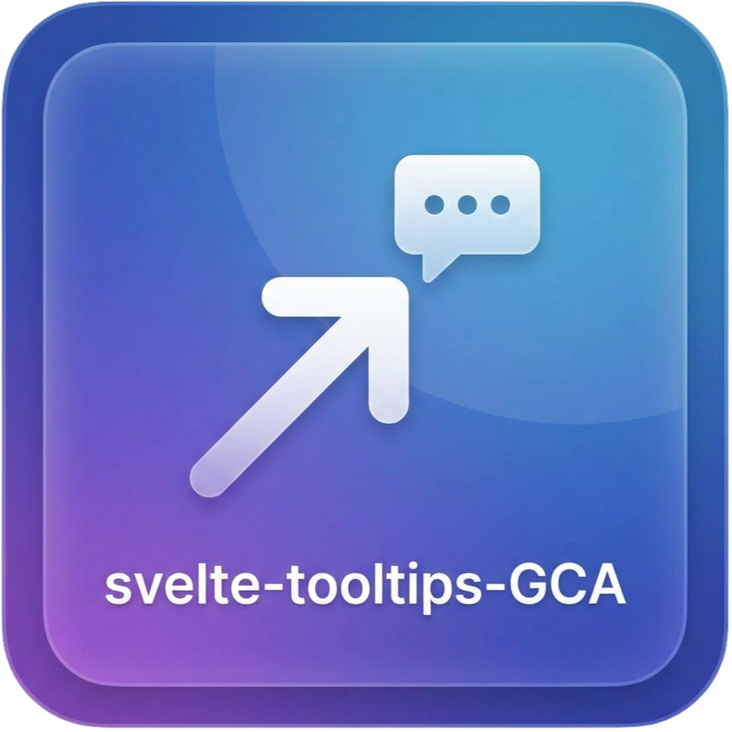

# svelte-tooltip-gca



Modern, theme-aware tooltips for **Svelte 5** as a simple action:

```svelte
<button use:tooltip={'Hello world'}>Hover me</button>
```

- **Svelte 5** action (`use:tooltip`)
- **Auto light and dark** theme detection
- **Custom themes** via a plain object
- **Desktop and mobile friendly** (hover, focus, tap, long-press)
- **Keyboard friendly**: opens on focus, dismisses with `Escape`
- **Top-layer rendering** via the native Popover API — never clipped, immune to z-index wars
- Smooth **enter and leave animation** (respects `prefers-reduced-motion`)
- **Smart positioning**: stays on the preferred side, shifts to fit, and the arrow re-aims at the target

Demo and Docs: [GitHub Pages](https://gabryca.github.io/svelte-tooltip-gca/)

NPM Repo: [npmjs.com/package/svelte-tooltip-gca](https://www.npmjs.com/package/svelte-tooltip-gca)

---

## Install

```sh
npm install svelte-tooltip-gca
```

Peer dependency: `svelte` ^5.0.0

---

## Quick start

```svelte
<script>
  import { tooltip } from 'svelte-tooltip-gca';
</script>

<button use:tooltip={'Saved!'}>Save</button>

<button
  use:tooltip={{
    content: 'Delete permanently',
    placement: 'right',
    delay: 200
  }}
>
  Delete
</button>
```

---

## Options

`use:tooltip` accepts a **string** or an **options object**:

| Option | Type | Default | Description |
| --- | --- | --- | --- |
| `content` | `string` | — | Tooltip text (required for object form) |
| `html` | `boolean` | `false` | Render content as HTML (trusted only) |
| `placement` | `'top' \| 'bottom' \| 'left' \| 'right'` | `'top'` | Preferred side |
| `overflowBehavior` | `'shift' \| 'flip'` | `'shift'` | Viewport-overflow strategy (see below) |
| `theme` | `'auto' \| 'light' \| 'dark' \| TooltipTheme` | `'auto'` | Theme mode or custom object |
| `offset` | `number` | `8` | Gap from target (px) |
| `delay` | `number` | `120` | Show delay (ms) |
| `hideDelay` | `number` | `80` | Hide delay (ms) |
| `arrow` | `boolean` | `true` | Show arrow |
| `animation` | `boolean` | `true` | Enable animation |
| `animationDuration` | `number` | `160` | Animation ms |
| `disabled` | `boolean` | `false` | Disable tooltip |
| `class` | `string` | `''` | Extra CSS class |
| `maxWidth` | `number \| string` | theme | Max width override |
| `touchBehavior` | `'tap' \| 'longpress'` | `'tap'` | Touch open behavior |
| `longPressDuration` | `number` | `400` | Long-press ms |
| `touchHideDelay` | `number` | `3000` | Auto-hide on touch (`0` = off) |
| `showOnFocus` | `boolean` | `true` | Show on keyboard focus |
| `onShow` / `onHide` | `() => void` | — | Lifecycle callbacks |

### Overflow behavior

By default (`'shift'`) the tooltip **stays on its preferred side**, slides along the
cross-axis to remain fully visible, and the **arrow re-aims** at the target element
even when the panel is off-centre. It only flips to the opposite side when there is
no room at all on the primary axis.

Pass `overflowBehavior: 'flip'` to restore the legacy strategy (try opposite, then
perpendicular sides):

```svelte
<button
  use:tooltip={{
    content: 'I flip to the other side when space is tight',
    placement: 'top',
    overflowBehavior: 'flip'
  }}
>
  Legacy flip
</button>
```

---

## Theming

### Auto (default)

```svelte
<button use:tooltip={{ content: 'Follows page theme', theme: 'auto' }}>
  Auto
</button>
```

Detection order:

1. `data-theme` / `data-color-scheme` / `data-bs-theme` on `<html>` or `<body>`
2. `.dark` / `.theme-dark` class
3. CSS `color-scheme`
4. `prefers-color-scheme` media query

### Force light or dark

```svelte
<button use:tooltip={{ content: 'Light panel', theme: 'light' }}>Light</button>
<button use:tooltip={{ content: 'Dark panel', theme: 'dark' }}>Dark</button>
```

### Custom theme

```svelte
<script>
  import { tooltip } from 'svelte-tooltip-gca';
  import type { TooltipTheme } from 'svelte-tooltip-gca';

  const brand: TooltipTheme = {
    background: '#ff3e00',
    color: '#1b1f24',
    borderRadius: '10px',
    shadow: '0 12px 28px -8px rgba(255, 62, 0, 0.35)',
    padding: '8px 12px'
  };
</script>

<button use:tooltip={{ content: 'Brand tip', theme: brand }}>
  Custom
</button>
```

Theme fields: `background`, `color`, `border`, `shadow`, `borderRadius`, `fontSize`, `fontFamily`, `fontWeight`, `padding`, `maxWidth`, `arrowSize`, `zIndex`.

---

## Mobile

- **`touchBehavior: 'tap'`** (default), first tap shows, second or outside tap hides
- **`touchBehavior: 'longpress'`**, press and hold to show (cancelled if the finger moves — e.g. to scroll)
- Auto-hides after `touchHideDelay` (default 3s)

## Accessibility

- Tooltips render with `role="tooltip"` and are wired up via `aria-describedby`
- Focusable elements open the tooltip on keyboard focus
- Pressing `Escape` dismisses an open tooltip
- Animations are disabled when the user prefers reduced motion
  (`prefers-reduced-motion: reduce`)

---

## Demo

Hosted demo: [Github Pages](https://gabryca.github.io/svelte-tooltip-gca/)

or:

Run the docs demo locally:

```sh
npm install
npm run dev
```

---

## Development and publish

```sh
npm run check     # type-check
npm run build     # build demo + package dist/
npm pack          # create tarball from dist/
npm publish       # publish to npm
```

Library source lives in `src/lib`. The showcase app lives in `src/routes`.

---

## Release Notes

### [1.0.4] - 2026-08-17

#### Changed

- Refreshed the docs with a responsive two-column hero, clearer navigation, accessible skip and focus states, and more focused playground, API, and example layouts.
- Improved tooltip viewport handling so fallback positions remain visible when neither the preferred nor opposite side has enough room.
- Constrained tooltip panels to the viewport and made long content scroll within the panel instead of escaping the screen.

#### Fixed

- Prevented edge-case positioning from producing negative coordinates on very small viewports.

See the complete history in [CHANGELOG.md](CHANGELOG.md).

---

## License

MIT
